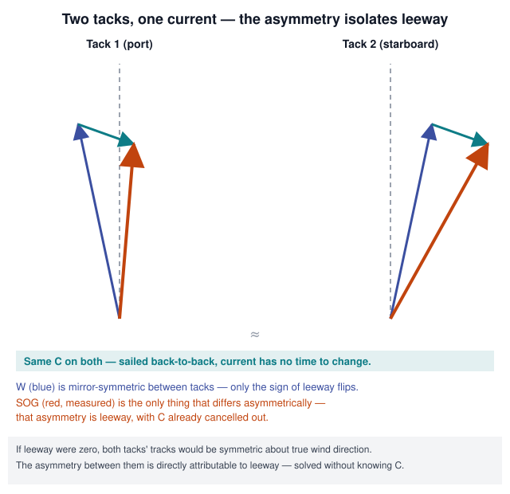
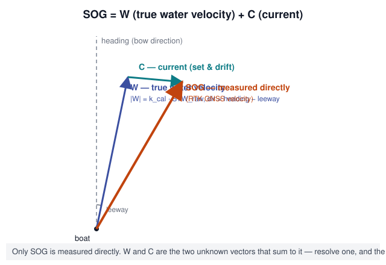

# Diagnosing and Correcting Speed-Through-Water Error on a Foil-Limited, High-Righting-Moment Racing Sailboat in a Current-Dominated, Variable-Conductivity Sailing Area

## Abstract

Speed through water (STW), measured by a paddlewheel log on a B&G H5000 processor, feeds every downstream performance number — true wind, target speeds, VMG — on this vessel. It is confirmed unreliable. This paper sets out why: the standard mitigations (manufacturer compensation, a heel-based correction table, GPS double-run calibration) each fix only part of the error; the dominant residual is leeway, poorly correlated with heel on this hull form; and the sailing area's strong, unpredictable current defeats the usual GPS-based workarounds for measuring either speed or leeway. It proposes a measurement architecture (two-axis flow sensing plus a joint calibration surface), a no-hardware fallback (the two-tack leeway test), and reviews available hardware.

## Executive summary

- **The problem.** STW is unreliable under sail. The two mitigations already in place — the H5000's internal compensation and a heel-based correction table — don't fix it.
- **Why.** The dominant error is leeway, not sensor drift: on this flat-bottomed, high-righting-moment hull, heel and leeway decouple (§3.2), so a heel-only table corrects the wrong variable. Reciprocal-course ("double-run") calibration fixes the paddlewheel's own offset/linearity but says nothing about leeway (§3.3) — different problems. Current is a second confound specific to this area: always present, spatially variable, untracked by tide tables, defeating the usual GPS shortcuts for measuring speed or leeway directly (§3.3).
- **Fix without new hardware.** The two-tack leeway test (§4.3) — a current-cancelling analog of the reciprocal-course test, applied to leeway — builds a real, condition-tagged leeway dataset from maneuvers the boat already does.
- **Fix with new hardware.** A direct two-axis (leeway-sensing) log removes the current confound entirely and is the only approach that still works on long, unmaneuvered legs where GPS-based methods go blind (§8.2). Two candidates exist — Airmar DX900+ and a Brickhouse Innovations design — each with one open risk to close before buying (§6).
- **Fix with RTK-GNSS.** Accurate real-time SOG/COG/heading lets current, leeway, and STW calibration be solved continuously instead of through discrete maneuvers (§8) — but only while heading keeps changing; on long unmaneuvered legs it's as blind as GPS alone (§8.2). How much heading change is needed was tested, not assumed: ordinary tacks/gybes (roughly 2-90°) work well; an exact 180° reciprocal course — intuitive, since that's what the *speed*-calibration test wants — is actually the *worst* case for separating leeway from current (§8.1).
- **The decision.** The continuous estimator becomes the authoritative STW source, paddlewheel demoted to fallback, with zero manual pre-race calibration and zero manual in-race math (§8.5): self-calibrating from ordinary sailing, degrading visibly (via a published accuracy figure) when heading diversity runs out, and recovering automatically once it returns.
- **Where this stands.** The diagnostic work here is finished; implementation continues in **PerfectPitch** (see Status).

## Status

**Closed out as the standalone analysis.** Both open technical questions from the RTK-GNSS discussion are answered: how large a course change actually separates leeway from current (§8.1, validated by simulation), and whether the system can run with zero manual calibration or in-race math (§8.5, yes, by construction).

All further work — implementation, simulation, firmware — happens in **PerfectPitch**, a moving-base RTK/IMU telemetry system for the same boat (`~/Documents/PerfectPitch`, private repo). Sections 5 and 8 here are written up as design work in that project's `docs/wave-math.md` ("PerfectPitch as the STW authority", "Authority and fallback") and `docs/reliable-stw/README.md` (an appendix-extended copy with a worked walkthrough), with matching items in `TODO.md`. This document won't change further except to fix errors; treat PerfectPitch's copy as the living version.

## 1. Introduction

The vessel is an extreme, flat-bottomed, high-pointing design with a B&G H5000 processor and paddlewheel STW sensor. Inconsistent derived numbers, and decisions made on them that later proved wrong, are strong operational evidence the STW signal isn't trustworthy. Two mitigations were already in place — the H5000's internal compensation and the SignalK "speed and current" plugin's static speed/heel correction table — and neither was adequate. The working hypothesis: leeway, the sideways component of the boat's motion through the water, is the primary unmodeled variable.

The sailing area compounds this. Current is constant and non-negligible; islands, channels, and mixed water bodies make tide tables unreliable in practice. Several standard techniques for correcting STW or estimating leeway implicitly assume current can be ignored, looked up, or cancelled by symmetric maneuvers — assumptions that hold poorly here.

## 2. Problem statement

The paddlewheel converts impeller rotation to speed, assuming flow arrives parallel to the centerline and represents free-stream flow. Both assumptions fail in normal sailing: flow arrives at a leeway angle whenever the boat balances the sail plan with lateral force, and the sensor sits inside the hull's boundary layer, where flow is retarded and disturbed. Static compensation tables (H5000 native or the SignalK "speed and current" plugin) correct for this using heel angle. The crew's own logged data shows this is insufficient: at matched speed and heel, measured leeway varies substantially with sail set, trim mode, and sea state — heel is empirically, not just theoretically, an inadequate proxy for the actual error.

## 3. Why this is hard: the underlying physics

### 3.1 Single-axis sensing and off-axis flow

A paddlewheel (like most conventional EM or ultrasonic logs) measures flow along one hull-fixed axis. At a nonzero leeway angle it's reporting a magnitude from a vector it can't fully resolve. The true-speed/leeway/raw-reading relationship isn't necessarily a clean cosine function — it's geometry- and flow-regime-specific — but the sensor is structurally blind to the transverse component that would let it self-correct.

### 3.2 Decoupling of heel and leeway on this hull form

On a conventional deep-keel monohull, heel and leeway are tightly coupled — both arise from the same lateral force balance through a fixed foil. On this flat-bottomed, high-righting-moment design, heel comes substantially from righting moment (crew position, rig loads), while leeway comes from how the flat sections and limited lateral plane resist side force — far more sensitive to angle of attack, speed, trim mode, and wave-driven wetted-shape changes. This program's own logged data confirms it directly: the same heel/speed combination produces materially different leeway depending on sail set, trim, and sea state. Any heel-keyed correction is fitting the wrong (or at least insufficient) variable.

### 3.3 The current confound

The two natural ways to get ground truth — STW vs. GPS SOG, and heading vs. GPS COG for leeway — both implicitly need the current vector, since both compare a water-referenced quantity to a ground-referenced one. Where current is always present, spatially variable, and poorly predicted by tide tables, neither comparison is trustworthy alone. COG-minus-heading is not leeway; it's leeway plus current set, and GPS/compass alone can't separate them — which is why naive "measure leeway with GPS" attempts collapse back into the same current problem.

Reciprocal-course ("double-run") calibration is a valid partial workaround: running a course and its reciprocal close together in time and space cancels current out of the averaged SOG, yielding real STW ground truth. This program uses it — but it only characterizes the paddlewheel's static offset/linearity, under whatever (typically low) leeway prevailed during the test. It cannot characterize the dynamic, trim- and wave-dependent leeway error that dominates under racing conditions. **This is the central finding of the diagnostic discussion: double-run calibration and leeway error are different problems, and solving the first doesn't touch the second** — consistent with the field observation that careful double-run work has done little for STW reliability under sail.

### 3.4 Boundary layer effects

Independent of leeway, conventional EM and paddlewheel sensors sample a small volume close to the hull, inside the boundary layer, where flow is slowed by skin friction and disturbed by turbulence — worse at speed and in waves. This compounds with the leeway problem rather than separating cleanly from it, since both are driven by the same conditions (speed, waves, trim-driven wetted shape).

### 3.5 Water conductivity as an EM-sensor-specific confound

EM log sensors work by Faraday induction: signal magnitude scales with water conductivity, high and stable in open ocean, much lower in freshwater, and variable — potentially within one outing — in brackish, mixed water, exactly this sailing area. An EM sensor without explicit conductivity/salinity compensation risks trading one systematic error (paddlewheel/leeway) for another (conductivity drift). This is a hard design requirement for any EM candidate here, not an incidental detail.

## 4. Methods evaluated

### 4.1 Reciprocal-course calibration (in use)

Cancels current, isolates paddlewheel offset/linearity. Valuable and retained, but per §3.3 it does not characterize leeway error and shouldn't be expected to.

### 4.2 Heel-based static compensation (H5000 native; SignalK "speed and current" plugin)

Both apply a fixed heel-to-correction table. This program's own logged comparisons show large unexplained variance, because heel alone doesn't determine leeway on this hull (§3.2). Retained only as a weak first-order correction.

### 4.3 The two-tack leeway test (proposed, no new hardware required)

A direct leeway analog of the reciprocal-course technique. Two tacks (port/starboard) sailed at matched TWA, speed, heel, and trim, close together so current is ~constant across both. With zero leeway, the two ground tracks (referenced to true wind) would be symmetric; the asymmetry isolates leeway without needing to know current. Repeated across the sail inventory, trim modes, and sea states, this builds a condition-tagged leeway dataset far richer than a heel curve, fitting a real multi-variable correction model even before any dedicated sensor. Recommended as standing practice regardless of hardware decisions.

## 5. Proposed measurement and calibration architecture

*Every method in this paper, from the two-tack test to the RTK-GNSS filter in §8, is one identity: what GPS measures over ground is the boat's true motion through water plus whatever the water itself is doing (current). Solving for one unknown means pinning down the other two first.*

Three parts:

1. **Direct two-axis flow sensing** — measuring longitudinal and transverse (leeway-axis) flow at the hull, so leeway is sensed rather than inferred from GPS, removing the current confound for this measurement entirely.
2. **Real-time correction of the raw longitudinal reading using measured leeway**, via an empirically derived (not assumed-cosine) response function, since off-axis response is geometry-specific.
3. **A joint, multi-variable calibration surface** — raw output as a function of true STW, leeway, and possibly heel — fitted together rather than as sequential corrections, since off-axis sensitivity plausibly varies with speed too (Reynolds-number-dependent flow separation). Practical compromise: establish baseline speed linearity in the lowest-leeway condition (flat water, near-zero heel), then fit the residual against measured leeway and heel from real sailing, checking afterward for any remaining speed/leeway interaction.

## 6. Candidate hardware

Two dual-axis EM sensor designs, from different companies, are directly relevant.

**Airmar DX900+.** Currently sold; outputs a direct leeway-angle sentence (NLA) alongside speed/log over NMEA 0183, up to 10 Hz, ±0.1 kt below 10 kt / ±1% above. Announced in 2009 as "DX900-EM," didn't ship for most of a decade, reached market around 2017. Field reports (marine electronics press, owner forums) describe reliability and calibration difficulties — inconsistent readings despite specified linearity, suspected interference on at least one carbon-hulled racer, sensitivity to bottom paint. Its patent (US10,852,142 B2, Airmar) documents a variable-gain preamplifier for salinity/conductivity compensation — a direct, shipping answer to the §3.5 concern.

**Brickhouse Innovations (Larry Marsh; US10,416,187 B2).** Smaller-scale. Its differentiator: moving electrodes away from the hull and out of the boundary layer — even a quarter- to half-inch offset is claimed to meaningfully cut boundary-layer contamination, with larger annular-coil variants sampling more water further out, directly targeting §3.4. Removable electrodes for fouling maintenance. Field-tested on Navy vessels 2014–2015; reads as specialist/small-batch — availability, pricing, and lead time need confirming directly. The reviewed patent text makes no mention of conductivity compensation — an open question, not a confirmed absence, that must be resolved with the manufacturer given this program's brackish water.

Any EM candidate, including a from-scratch build, needs conductivity/salinity compensation as a hard requirement here, not an edge case — its absence risks trading one poorly understood error for another.

## 7. Open questions and next steps

- Confirm with Airmar (or carbon-hulled DX900+ owners) whether carbon-hull interference is a material risk here.
- Get a direct answer from Brickhouse on salinity/conductivity compensation and brackish/fresh validation.
- Begin two-tack leeway testing (§4.3) across the sail inventory and trim modes this season, independent of any hardware decision.
- Decide between the DX900+, a Brickhouse purchase/build, or refining the two-tack-derived correction table, based on the above.
- Once real two-axis data exists, fit the joint calibration surface from §5 rather than a heel-only table.

## 8. RTK-GNSS continuous sensor fusion: what it can and cannot fix

RTK-GNSS raises a question: with accurate real-time SOG/COG/heading, can current, leeway, and STW calibration be estimated continuously (e.g. an EKF) instead of through discrete maneuvers? Conditionally yes — the conditions determine whether this substitutes for dedicated leeway hardware or only complements it.

### 8.1 The observability argument

At any instant, the GNSS velocity vector (north/east) equals the water-velocity vector (STW at a leeway offset from heading) plus current — three unknowns (current's two components, leeway), two equations. RTK-grade GNSS removes measurement noise but not the missing equation; the system stays underdetermined by one degree of freedom.

Tacking or gybing supplies the missing information: heading changes substantially while current stays fixed, giving independent equations to separate the two — the continuous, generalized version of the two-tack test (§4.3).

How large a change is "substantially"? Tested, not assumed (Monte Carlo simulation at RTK-grade noise, `sim/heading_diversity_sweep.py` in PerfectPitch). Intuition says an exact 180° reciprocal course — already used for the §4.1 speed calibration — should also be best here. It's the opposite: the worst case. Error grows monotonically toward 180° — leeway RMS error ~0.46° at a 2° heading change, ~0.97° at 90°, 48° at 178°, with the design matrix's condition number spiking from ~9 to over 500. At exactly 180° the second leg's equations exactly duplicate the first's, and all cross-track current information is lost — opposite of the §4.1 test, which wants 180° because it cancels current by averaging along a fixed line to isolate STW scale, a different unknown wanting the opposite geometry. The safe range (leeway RMS error under 1°) is roughly 2-90°, covering essentially any ordinary tack or gybe — including this boat's unusually narrow tacking angle, a favorable property here.

One correction to an earlier version of this reasoning: leeway is not "slowly varying" like STW calibration. It responds to gusts, waves, and trim on a timescale of seconds, not the minutes-to-hours timescale of current. Conflating the two time constants risks misattributing current drift to leeway, or fast leeway swings to current, with no way for a GNSS/heading-only filter to tell which occurred.

### 8.2 The failure case: long, unmaneuvered offshore legs

This vessel regularly sails long (~12-hour) offshore reaches with no tacks or gybes — exactly where the observability argument fails: no heading excitation to separate current from leeway, while leeway itself keeps changing with sea state and puffs. A GNSS/heading-only estimator can't reliably tell current change from leeway change here. This is structural, not a filter-tuning gap.

Because the boat's actual sailing profile includes such legs, **a dedicated two-axis flow sensor isn't a nice-to-have — it directly covers the exact case the software-only approach can't**, since a direct sensor is observable on a straight reach exactly as well as mid-tack.

### 8.3 A partial mitigation: geographically-primed current, solved-for leeway

Absent a dedicated sensor: rather than solving for current and leeway jointly from a blank state at the start of a long leg, prime the filter with a current *prior* from a geographically-indexed atlas (built from previous transits of that water, ideally tidal-phase-tagged; §5), holding current fixed at that prior for the leg. Defensible because open, non-tidal offshore current varies far more slowly than leeway. With current pinned, the GNSS-vs-predicted residual attributes to leeway alone, restoring single-leg observability without a heading change. Bounded by atlas coverage — unvisited water has no prior, and the boat is back to needing a direct sensor or an external current source (a different, oceanographic-scale problem from the tidal/channel current this paper addresses).

### 8.4 Downstream consequence: which "true wind" is exposed to STW error

STW error doesn't propagate equally into every wind number — relevant since True Wind Direction is a primary derived value here. Conventional "true wind" (apparent wind + STW/heading, i.e. velocity *through water*) is fully exposed to every error in this paper. "Ground wind" (apparent wind + SOG/COG, velocity *over ground*) never touches the paddlewheel or leeway model, so with RTK-GNSS it becomes highly trustworthy independent of STW error. It isn't the number polars are built around, and isn't identical to true wind relative to the water mass when current is present, but it's a genuinely STW-independent cross-check — useful against GRIB forecasts, and as a health indicator: an implausible divergence from the conventional number itself signals STW/leeway error worth surfacing, once RTK is fitted.

### 8.5 Design decision: full STW authority, paddlewheel as fallback, zero manual intervention

The RTK-GNSS discussion closed on a concrete requirement: PerfectPitch's corrected STW should not just offer a second opinion — it should take over as the primary, authoritative source, paddlewheel demoted to fallback, **without a dedicated pre-race calibration procedure and without manual math during a race**.

- **No manual pre-race calibration.** A continuous estimator needs heading diversity, not a discrete procedure — an ordinary pre-start sequence and first beat already supply it (§8.1's validated 2-90° safe range covers essentially any real tack). The filter starts from a wide-uncertainty prior and tightens automatically as the boat sails; no dockside ritual required.
- **No manual math during a race.** The only number exposed to the crew is corrected STW plus a live accuracy figure (knots, from the filter's covariance) — never raw values requiring arithmetic.
- **Paddlewheel as fallback, not a second source.** The fused estimate is authoritative while its accuracy stays within a confidence threshold; when it degrades (notably on the §8.2 long unmaneuvered legs), the output blends toward the *last well-conditioned calibration factor* applied to the live raw paddlewheel — not the uncorrected signal this document opened by establishing as unreliable. True raw paddlewheel is reserved for the one case where RTK itself is unavailable.

This closes out the reasoning here; the remaining work is implementation, in PerfectPitch (see "Authority and fallback" in `docs/wave-math.md` for the full blending logic).

## 9. Conclusion

STW's unreliability on this vessel is the superposition of at least three effects — paddlewheel offset/linearity (fixed by reciprocal-course calibration, already in use), leeway-driven off-axis flow error (poorly predicted by heel, untouched by reciprocal-course calibration), and boundary-layer sampling error — compounded by an operating environment where GPS-based shortcuts for speed or leeway ground-truth are confounded by persistent current. The path to a trustworthy STW signal runs through direct two-axis flow sensing (or systematic two-tack testing) feeding a jointly fitted, multi-variable calibration surface, not a better heel table. Available hardware exists and is broadly the right architecture, but each candidate carries an unresolved risk (hull-material interference; unconfirmed conductivity compensation) to close out before committing. §8 extends this from diagnosis into design once RTK-GNSS is added — see the Executive summary and §8.5 for where that lands.

## References

See `references/sources.md` in this folder for the full list of patents and articles cited above, with direct links.
